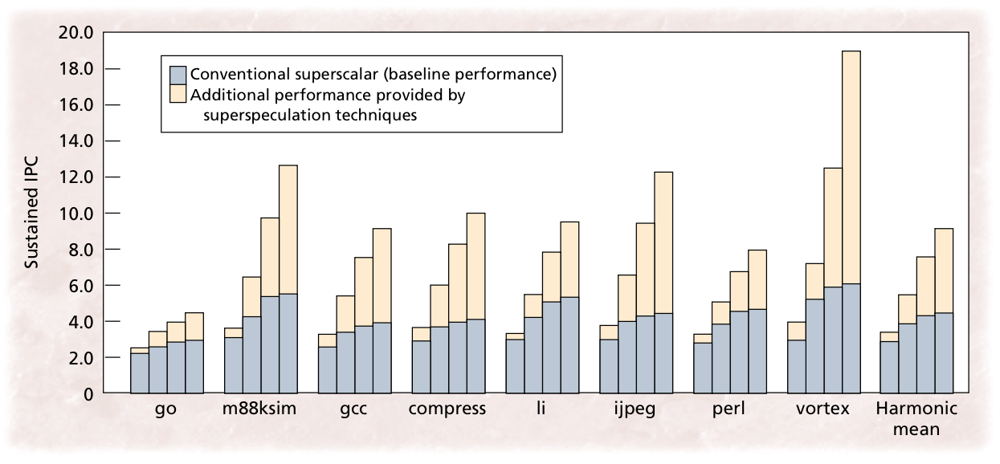
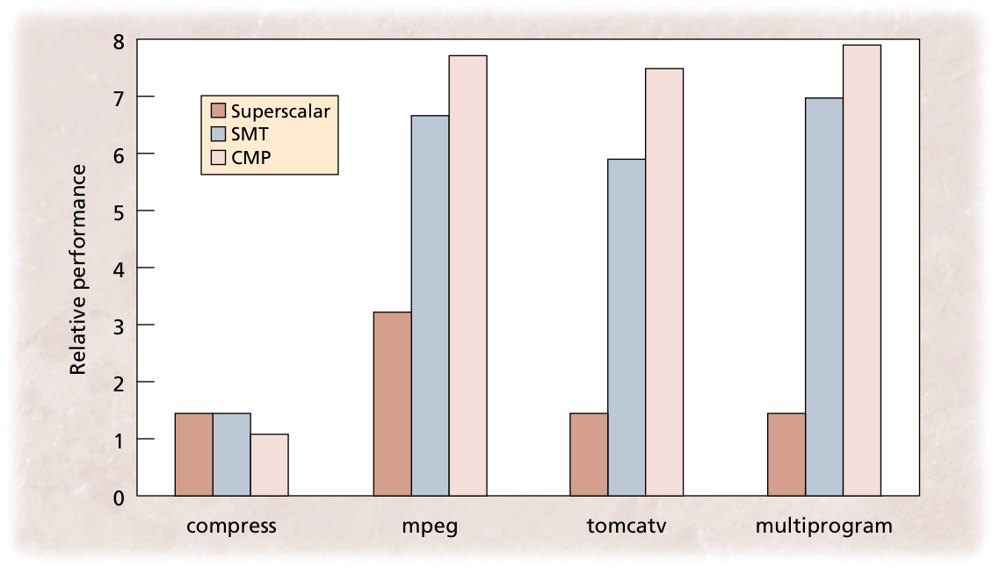

# Paper C: Superspeculative Microarchitecture for Beyond AD 2000

## Description

This article describes class of techniques termed superspeculative and provides an implementation of these techniques in a microarchitecture called Superflow. It claims that this new paradigm gets performance increases over top-of-the-line microprocessors of the time by predicting values produced by producer instructions and executing consumer instructions before the values become known.

Main reason to speculate about values of instructions is the classical dataflow limit for program performance:

 > _Given unlimited machine resources, a program cannot execute any faster than the execution of the longest dependence chain induced by the program's true data dependences._

This means that even with a very wide conventional superscalar the performance is limited by the serialisation of producer and consumer instructions. The only way to speed up the execution is to try to predict values before they become known. If the prediction is successful, this "breaks" the serialisation.

At the time, most machines adopted a strong-dependence model. This model specifies that instructions are possibly executed out-of-order but only if there is no dependence. What this means that dependences between instructions are never violated. The authors claim that this model is "too rigorous and unnecessarily restricts available parallelism".

To be able to predict operands of consumer instructions, the authors propose a weak-dependence model. In this model the machine can temporarily violate dependences and speculate about operand values as long as it can recover from misspeculations. If a substantial number of predictions is correct, the paper claims that the machine can outperform, traditional strong-dependence machines.

## Results

In Superflow, the authors implemented superspeculative techniques that improve instruction flow, register dataflow and memory dataflow. They claim that the techniques frequently more than double the performance of a conventional superscalar processor. In fact, Superflow has a potential performance of 9 instructions per cycle and simulations yielded 7.3 IPC for the SPECint95 benchmark suite. These results were possible without recompilation or changes to the instruction set architecture (ISA).

## Discussion

**Why did the approach proposed did not succeed?**

**What was the main “flaws” in the authors’ reasoning and expectations that led to the demise of the approach?**

**What were the main factors driving commercial designs away from the proposed approach?**

**Are these factors still valid today?**

**Are the quantitative results presented still sound?**

**If not, then why are they not sound today and if yes then why are they not compelling?**

# Paper B

## Description

This article compares three different architectures that try to exploit parallelism available in computer programs: superscalar, simultaneous multi-threading (SMT) and chip multiprocessor (CMP). The superscalar architecture has one CPU and can execute 12 instructions in parallel. The SMT also has one CPU and same instruction level parallelism but can run up to 8 threads. The CMP has 8 CPU cores, all on one chip, and each of these CPUs can run only one thread and has an issue width of 2.

## Results

According to the results of simulations ran by the authors, the CMP architecture offered superior performance with simpler hardware than both SMT and superscalar architectures. A chart with relative performance can be observed in figure \ref{benchmarks2}.

For code that can be parallelised into threads, the CMP architecture performs better or equally well as the more complicated wide-issue superscalars or SMT architectures. The SMT architecture has a more efficient resource utilisation than CMP but CMP can include more execution units in the same area due to its smaller issue width.

For code that cannot be parallelised into threads, the CMP architecture lags behind the other options due to its simpler design. However, the difference in performance is only minor because code that cannot be parallelised into threads usually cannot make much use of the wider issue-width of superscalar and SMT processors.

## Discussion

One of the main reasons the CMP design succeeded is because of its simpler hardware. It is a composition of smaller, identical CPUs. Since these CPUs use ISA built on top of ISA of single-core architectures of previous era there were no backward-compatibility issues.

The main factors driving commercial designs to adopt the single-chip multiprocessor approach were:

 - **Good scaling:** The CMP architecture uses a group of small, identical CPUs. Since the processor is relatively simple the implementation costs are lower and since they are identical this cost is paid only once. Furthermore, since the CPUs are clustered, it scales well if the number of cores is ever increased. This is in contrast, for example, with superscalars where the number of registers and their ports must increase proportionally to the instruction window size.
 - **Mapping threads to cores:** In the CMP architecture the operating system allocates a single thread to every processor. This allows the cores to be small and fast. Moreover, there does not need to be any hardware allocating instructions to different cores. This hardware could severely lengthen the cycle time for an SMT architecture.
 - **Compilers:** Exploiting instruction level parallelism in a compiler is difficult when your CPU can handle up to 12 instructions at a time. And where do you go once you reach the limit of instructions that can be executed in parallel? Clearly, the wide-issue processor solution has a limit. It is believed this is about 10-15 instructions per cycle [^ilp-limits]. On the other hand, programmers could parallelise their programs by running multiple threads per application. The compiler then knows the threads can run in parallel and even if they need to communicate frequently the proximity of the cores on a chip ensures this communication is fast.

The most popular commercial processors of the last 10 years or so are all single-chip multiprocessors: Intel Core i Series, IBM Power8, and AMD Bulldozer. However, chip makers have lately been trying to combine CMP and SMT. An example of this is Intel's hyper-threading technology and AMD's clustered multi-thread (CMT) technology. This way the processors utilise resources that would otherwise be idle.

[^ilp-limits]: D.W. Wall, Limits of Instruction-Level Parallelism, WRL Research Report 93/6, Digital Western Research Laboratory, Palo Alto, Calif., 1993.
