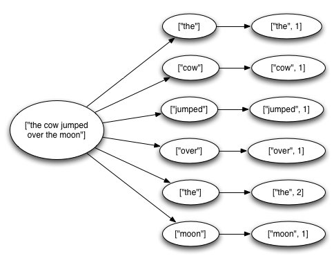

% Storm on multicore
% Mark Nemec
% October 8, 2014

### What is Storm?

 * Real-time distributed computation framework
 * Defined in terms of a topology using spouts and bolts
 * Programming language agnostic
 * Fault-tolerant

 * Storm is a real-time distributed computation network.
 * Computation is defined in terms of a topology which consists of spouts which represent data streams and bolts which can perform map and reduce operations on these streams.
 * Storm is programming language agnostic due to Apache Thrift, which means you can define spouts and bolts in any language supported by Thrift.
 * Storm is fault-tolerant. When a work dies, it restarts it. When a node dies it starts the workers on a different node.

---

### Example Topology

> Spout -> Bolt 1 -> Bolt 2

 * Spout generates random sentences.
 * First bolt splits the sentence into words.
 * Second bolt counts the word occurrences.

 * Here is an simple example topology where we have a spout generating random sentences.
 * Next we have a bolt which splits the sentence into words and emits those.
 * Lastly we have a spout which counts the occurrences of words.
 * There is a daemon called acker which informs the master node when a tuple has been fully processed or if it failed to get processed.

---

### What is my project about?

> Borrowing ideas from Storm and applying them in the context of multi-core CPUs.

 * Perform parallel computation on a single multi-core server.
 * Complete control over computation
 * No need to rent clusters in a data centre.
 * Remove overhead from nodes communicating across a cluster.
 * Could be used as a task running within a Storm cluster.

 * The aim of my project is to allow for similar computations on a single server with a multi-core CPU. Storm already has a local mode but it's not optimized for single server - it is useful for development and testing but otherwise it is a mere cluster simulator.
 * It allows you to have complete control over your computation without having to own a data centre.
 * Another benefit of doing these computations on a single server is that there is no overhead for servers communicating over network.
 * Lastly, my port could be used as a task deployed to a worker in a Storm cluster.

---

### My plan

 * Change only implementation, keep interfaces the same.
 * Replace ZooKeeper messaging with thread messaging or shared memory.
 * Write code with Java because I am familiar with it.

 * My plan is to change as little code as possible so the interfaces can stay the same but the implementation is different.
 * I plan to replace inter-cluster message passing with message passing between threads. This means removing the ZooKeeper layer, remote procedure calls, HDFS file system
 * I plan to write code in Java even though most of the Storm core functionality is implemented with Clojure.

---

### Timeline

 1. ~~Learn how to use Storm.~~
 2. ~~Read some tutorials on Clojure.~~
 2. ~~Make notes on how Storm works.~~
 3. Dive into the project and pick the low hanging fruit.
 4. Implement the functionality iteratively as required.
 5. Aim to finish coding by end of January.
 6. Write report.

 * So far, I have learned to become a user of Storm. This means I know how the system works and how it should behave even though the core of it will change.
 * I have also learned multiple tutorials on Clojure, since most of the core functionality is written in Clojure.
 * I have also gone through the source code of the project and made notes on how certain components interact.

---

# Thank you for   attention.

 <!-- *  -->
