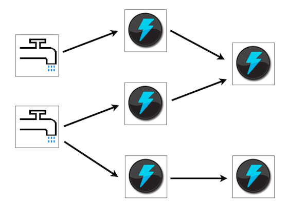
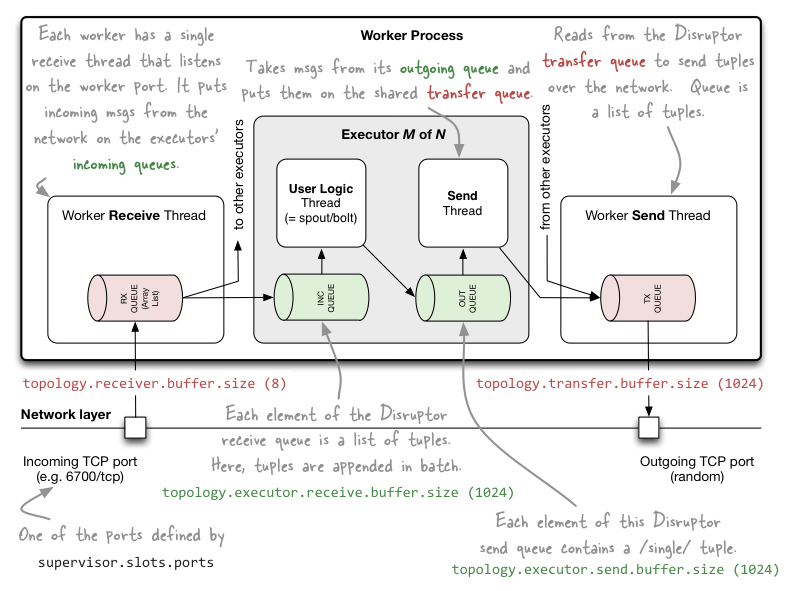
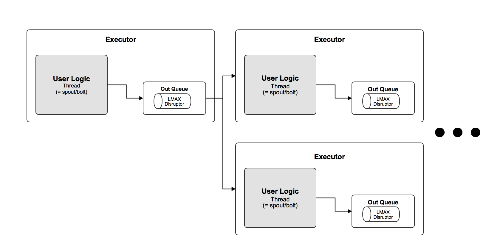

% Storm on multicore
% Mark Nemec
% November 26, 2014

### What is Storm?

 * Real-time distributed computation framework
 * Defined in terms of a topology using spouts and bolts
 * Programming language agnostic
 * Fault-tolerant

 * Storm is a real-time distributed computation network.
 * Computation is defined in terms of a topology which consists of spouts which represent data streams and bolts which can perform map and reduce operations on these streams.
 * Storm is programming language agnostic due to Apache Thrift, which means you can define spouts and bolts in any language supported by Thrift.
 * Storm is fault-tolerant. When a work dies, it restarts it. When a node dies it starts the workers on a different node.

---

### Timeline (from last time)

 1. ~~Learn how to use Storm.~~
 2. ~~Read some tutorials on Clojure.~~
 2. ~~Make notes on how Storm works.~~
 3. Dive into the project and pick the low hanging fruit.
 4. Implement the functionality iteratively as required.
 5. Aim to finish coding by end of January.
 6. Write report.

 * So far, I have learned to become a user of Storm. This means I know how the system works and how it should behave even though the core of it will change.
 * I have also learned multiple tutorials on Clojure, since most of the core functionality is written in Clojure.
 * I have also gone through the source code of the project and made notes on how certain components interact.

---

### Timeline (actually)

 1. ~~Learn how to use Storm.~~
 2. ~~Read some tutorials on Clojure.~~
 2. ~~Make notes on how Storm works.~~
 3. Read some more tutorials on Clojure.
 4. Understand the implementation of Storm.
     - LMAX Disruptor
 3. Learn a **lot more** about Clojure.
 4. Start with a clean sheet and implement trimmed Nimbus (master node).
 5. Add other components when referenced in code.
 5. Aim to finish coding by end of January.
 6. Write report.

 * What I underestimated was how much of the implementation is written in Clojure and how difficult it is to read and understand Lisp code.
 * Moreover, while I understood the interfaces involved in Storm I did not really know how they are implemented. For example, the LMAX Disruptor which is used as a queueing system within a worker.
 * I read a paper on NaaStorm and saw that what hampered progress for the guy was not understanding Clojure fully, thus I realised I still needed to learn a lot more about Clojure.
 * 

---

### Timeline (actually)

 1. ~~Learn how to use Storm.~~
 2. ~~Read some tutorials on Clojure.~~
 2. ~~Make notes on how Storm works.~~
 3. ~~Read some more tutorials on Clojure.~~
 4. ~~Understand the implementation of Storm.~~
     - ~~LMAX Disruptor~~
 3. ~~Learn a **lot more** about Clojure.~~
 4. ~~Start with a clean sheet and imple~~ment trimmed Nimbus (master node).
 5. Add other components as they are referenced in code.
 5. Aim to finish coding by end of January.
 6. Write report.

 * What I underestimated was how much of the implementation is written in Clojure and how difficult it is to read and understand Lisp code.
 * Moreover, while I understood the interfaces involved in Storm I did not really know how they are implemented. For example, the LMAX Disruptor which is used as a queueing system within a worker.
 * I read a paper on NaaStorm and saw that what hampered progress for the guy was not understanding Clojure fully, thus I realised I still needed to learn a lot more about Clojure.
 * 

---

### Design Decisions

 * Start with only one topology at a time
 * Remove workers, have just executors running tasks (Thread)

---

### Storm Worker

---

### Storm Multi-core Executor Thread

---

# Thank you for   attention.

 <!-- *  -->
