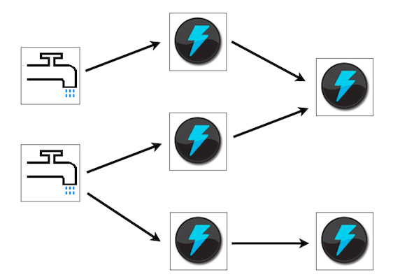

% Storm on multicore
% Mark Nemec
% October 8, 2014

# What is Storm?

. . .

distributed computation framework 

. . .

# What is my project about?

Borrowing ideas from Storm and applying them in the context of multicore CPUs.

# Challenges

 * 50% of the codebase is in Clojure.
 * Distributed systems are hard.
 * 

# My plan

 * Learn all about how the system works.
 * Find functionality that needs to be stripped.
 * 

# My progress

 * Learned how to use Storm.
 * Went through the codebase and wrote notes.
 * Made this presentation.

# Thank you for your attention
