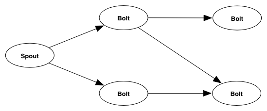
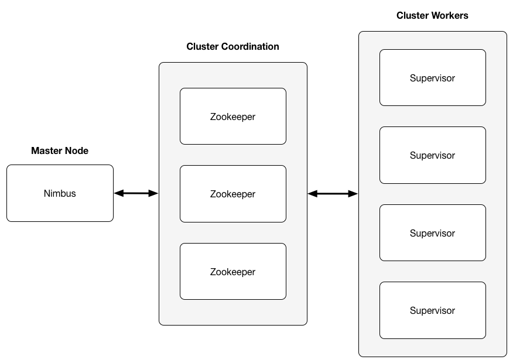
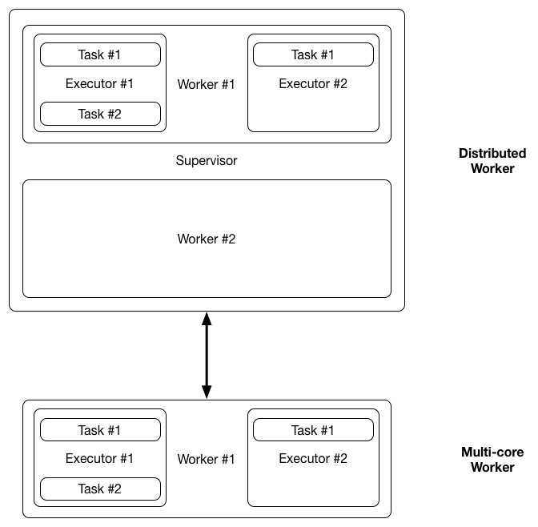

# Introduction

## Motivation

In recent years, there has been an explosion of cloud computing software. After Google published their paper on MapReduce, many new open-source frameworks for distributed computation have emerged, most notably Apache Hadoop for batch processing and Apache Storm for processing data streams. The main idea of these frameworks is to split the work that needs to be carried out and distribute it across multiple nodes of a cluster.

Commercial companies and researchers have been able to utilise these frameworks and create distributed systems which can accomplish things that would not be possible on a single computer. This has mostly been allowed by the low price of commodity hardware and its good scaling. While the price of such systems is perhaps lower than the price of a supercomputer with equal power there are certain limitations:

 - The nodes of a cluster need to communicate through a network. This limits the speed of communication between processes that live on different nodes. <!-- proof/figure -->

 - Distributed systems waste resources due to data replication which enhances reliability and possibly performance. Moreover with replication comes the problem of consistency.

 - To run a distributed computation on commodity hardware one would usually need a data centre or to rent out instances on cloud computing services such as Amazon EC2 or Rackspace. This is not ideal for some use cases which require full control over the system or a heightened level of security.

On the other hand, even though Moore's law still holds true, processor makers now favour increasing the number of cores in CPU chips to increasing their frequency. <!-- mention why --> This trend implies that the "free lunch" of getting better software performance by upgrading the processor is over and programmers now have to design systems with parallel architectures in mind. However, there are some limitations to this as well:

 - It is generally believed that writing parallel software is hard. The traditional techniques of message passing and parallel threads sharing memory require the programmer to manage the concurrency at a fairly low level, either by using messages or locks.

The main idea of this project is to apply ideas from distributed systems not in the context of clusters but in context of multi-core CPUs. This way, we could bring some of the knowledge from distributed systems to a single computer in operation. To do this, this project presents a port of the Apache Storm project for multi-core CPUs.

## Apache Storm Overview

Apache Storm is a distributed real-time computation system. It has a simple API that allows the user to break down a computation into separate components and then define how these components interact with each other.

### Representation

Storm breaks down a computation to a network of components which pass tuples between them. Storm represents this network as a directed acyclic graph (also called a topology) and the components can be of two types:

Spout:

:   A spout is a source of the data-stream of the network. Typically, a spout reads from a message broker such as RabbitMQ or Kafka but can also generate its own stream or read from somewhere like the Twitter streaming API.

Bolt:

:   A bolt takes a data stream as an input and transforms it into a different stream as its output. A bolt can perform a range of functions e.g. filter out tuples based on some criteria or perform a join of two different input streams.

### Architecture

A Storm cluster consists of a master node called Nimbus, a number of Zookeeper nodes handling the coordination of the cluster and worker nodes which perform the computation corresponding to different components.

Nimbus:

:   The Nimbus node is responsible for receiving commands from the user and informing the rest of the cluster. Nimbus is the node the user submits a topology to as well as the node that assigns workers components they will be working on.

Zookeper nodes:

:   These nodes are the glue between the Nimbus node and the worker nodes within the cluster. Nimbus uses the Zookeeper nodes to communicate with the worker nodes.

Worker nodes:

:   A worker node runs a daemon called Supervisor which spawns worker processes that listen to messages on a socket and run executor threads which transform the tuples.

### Inside a worker node

There are three main entities used to execute a topology on a Storm cluster:

Worker:

:   A worker is a process that is assigned a port and listens to tuple messages on a socket associated with the port. Whenever it receives a tuple, it puts it on a queue where it is picked up by one or more executors of the worker process.

Executor:

:   An executor controls the parallelism within a worker process. Every executor runs in a separate thread. Their job is to pick up tuples from the receiving queue, perform the function of a component they represent, and put the transformed tuples on the transfer queue, ready to be sent along to the next component. An executor runs one (the usual case) or more tasks.

Task:

:   A task performs the actual data processing. However, within an executor thread all the tasks are executed sequentially. The main reason for having tasks is that the number of tasks stays the same throughout the lifetime of a topology but the number of executors can change (via rebalancing). Thus if some worker nodes in the cluster go down, the topology can continue executing with the same number of tasks as before. <!-- maybe mention adding worker nodes keeps same # of tasks as well -->

\pagebreak

# Implementation

## Nimbus

A Nimbus node is the master node of a cluster. Usually the process of submitting a topology to Nimbus follows the following steps:

 1. User starts up the Nimbus node, supervisor nodes, and Zookeeper nodes.
 2. User submits a new topology to the Nimbus node.
 3. The Nimbus node uploads code to all the supervisors and makes assignments which it writes to Zookeeper.
 4. Workers running on a supervisor read their assignments from Zookeeper, create executors that execute the code.
 5. Nimbus keeps running and listens for commands to either rebalance, activate, disactivate, or kill a topology.

The daemon running on a Nimbus node of Storm is actually a server which responds to user requests. There is not really a need for this in the multi-core setting where Storm could be used as a library which the user would import into their project. To be able to execute multiple topologies at the same time, the user can just spawn more processes.

Therefore, lot of the functionality of a Nimbus process needed to be stripped from the project to avoid high overheads and running it as a separate process. 

## Thrift objects

Since Storm runs on a cluster, serialisation plays an important role. Objects need to be serialised whenever they are going to be sent through the network and deserialised when received by a worker. Storm uses the Thrift framework to do this. Given a Thrift definition for a class, Thrift automatically generates serialisation code for any of several languages.

While serialisation is important in a distributed system, there is no need for it in a multi-core setting. Hence all the code generated automatically by Thrift had to be rewritten as well as portions of code that referenced it.

## Clojure

According to the Storm documentation "the great majority of the implementation logic is in Clojure". Clojure is a dynamically typed LISP dialect that targets the Java Virtual Machine.

Worried that not knowing the language would hinder progress, a lot of time was spent getting comfortable with the language and reading documentation. This proved to be a good decision in hindsight as building up on the existing Clojure code proved to be more efficient than rewriting the implementation in Java.

## Worker and Executor for Multi-core

In Storm, workers run within a supervisor process. Every worker potentially runs several executors which are implements as threads. Thus, a sensible way to transform this into a multi-core setting is to force all the executors of a topology to run within one worker. This way, the only part that needed to be stripped from a worker is the code that handles inter-worker messaging.

What is left is multiple executor threads interacting with each other by picking up input tuples from their queue and putting output tuples on a queue of an executor they have a directed edge to. The queue that is being used in the original Storm as well as my implementation is the LMAX Disruptor.

\pagebreak

# Future work

## Code optimisation

There still remains some code that could be optimised for a multi-core setting. Few operations could be done faster with less overhead and fewer steps. Moreover, while porting the framework I noticed several cases where non-optimal, higher-order polynomial, algorithms were used.

## Tests against original Storm

It would be good to see how the Storm multi-core port compares to the original Storm in terms of speed. Since I only removed modules it should be a given that the multi-core port is faster. However, this needs to be confirmed by benchmarking both frameworks on some example topologies.

## Tests against a lower-level parallel program

It would also be interesting to see how running a topology on multi-core Storm compares to a shared-memory or message-passing implementation of a simple parallel program. If the performance difference is marginal, I could argue that writing a program that uses multi-core Storm for processing a data stream on a single computer is not only easier than writing such a program from scratch but has a similar performance.

## CPU Affinity

It would be interesting to see if binding a thread to a CPU core would improve the performance of the system. There is an open-source Java Thread Affinity library [^threadaffinity] that allows you do this with a fairly simple API. There is an article [^affinityarticle] that supports the idea that affinity could make a difference, even though it may only be minimal.

# Conclusion

In conclusion, I believe the project has been going more or less according to the plan. As for the multi-core Storm implementation, I have been able to test simple topologies and the results produced have been valid.

[^threadaffinity]: OpenHFT - Java Thread Affinity
[^affinityarticle]: http://vanillajava.blogspot.co.uk/2013/07/micro-jitter-busy-waiting-and-binding.html
[^disruptor]: LMAX Disruptor
