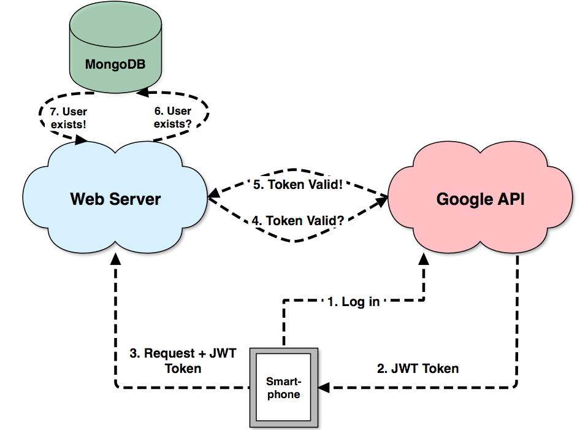

Title:  Slip Report
Author: Mark Nemec
Date:   January 15, 2015

# Table of Contents

<!--TOC-->

# Introduction

The goal of the WindSol project is to take measurements of solar intensity and wind speed in possibly remote locations and upload them to a server through an Android application so they can be later analysed by a user who is thinking about getting a solar panel or a wind turbine installation.

To achieve our goal we built a back-end web service that stores these measurements in persistent storage and serves information about the measurements to clients.

To turn the information about measurements into information useful for our user we built a front-end application that is a client to the service.

# Requirements

Following are functional and non-functional requirements we thought were important for our system to be able to perform.

## Back-end Service

### Functional Requirements

 - Provide an endpoint to which the Android application can upload measurements.
 - Store the measurements in persistent storage so they can be retrieved.
 - Provide an interface which the web client can use to request information about the measurements.
 - Create an authorisation system so that only authorised users can upload measurements.

### Non-functional Requirements
 
 - We wanted our server to be free.
 - Available on the whole of Internet, not just on LAN where the WindSol installation is located.
 - Preference for ease of development rather than server performance.

## Front-end Application

### Functional Requirements

 - Display information about measurements in a way useful for the user.
 - Allow users to filter information by specifying a date range.
 - Display on a map where measurements were taken from.
 - Allow user management so that new users can be authorised to upload data.
 - Provide log in and log out actions so that users can authenticate.

### Non-functional Requirements

 - Make the design responsive so that it works on mobile as well as desktop clients.
 - Cross-browser compatibility.

# Design & Architecture

## Back-end Service

We built the back-end service using a Javascript web framework Express.js [^expressjs] running on top of the Node.js [^nodejs] platform and a NoSQL database MongoDB [^mongodb]. Additionally, we used a key-value cache called Redis [^redis] to store temporal data. We hosted these services on top of a cloud application platform called Heroku [^heroku]. Heroku normally costs money but they have a free option which provided us with 512MB of RAM and one dyno (lightweight container specific to Heroku). This proved to be performant enough for our prototype.


### Web Server

As mentioned, the server code was developed in Express.js and Node.js. We considered other options but this combination provided us with certain advantages I would like to outline now.

#### Sharing Code

Since we planned to write both the server and the client in Javascript, there was a possibility of sharing code so that both front-end and back-end can use the same source code. This is one of the chief arguments for Node.js because it allows you to update front-end and back-end code in one place in one language.

#### Event-driven non-blocking model

Node.js is said to be "perfect for data-intensive real-time applications" [^nodejs]. We thought this was ideal for our purposes as we planned to upload measurements at a high rate.

#### NPM Package Manager

Node.js comes with a package manager called npm. This allowed us to install an array of libraries that we used for back-end as well as front-end code with a single command. Moreover, all the libraries that we used are stored in a file so that if someone new wanted to work on the source code they would just run one command to install them all and be ready to develop.

#### Ease and Speed of Development

Even though mature web frameworks also exist for statically typed languages, we rejected them as we preferred the ease of development of web frameworks written in dynamically typed languages. This allowed for rapid progress.

### Persistent Storage

To store measurements into persistent storage we decided to use a NoSQL database called MongoDB. The free tier MongoDB add-on for Heroku provided by Compose [^compose] comes with 1 GB of storage. There were several reasons we chose MongoDB over other solutions.

#### Dynamic Schemas

MongoDB is a NoSQL database with dynamic schemas. This means that documents stored in one collection do not have to comply to a schema. This allows for rapid development and proved to be suitable for our project as the schema of data sent from the mobile application changed frequently during development.

#### Geospatial Indexing

MongoDB comes with support for geospatial indexing and querying. This means that we could execute database queries on location information allowing us to, for example, find all historical measurements near user's area.

### Temporal Storage

While developing our back-end we realised the need for fast-access temporal storage. This is where we decided to use Redis. Redis serves as a key-value cache that is stored fully in main memory. Access to data is then limited by network speed between the web server and the Redis server rather than by disk I/O.

There is a free tier Redis add-on for Heroku provided by Redis Cloud [^rediscloud] that provided us with 25MB of storage (in main memory) which turned out to be more than enough for our purposes.

## Front-end Application

We developed the front-end application using Backbone.js [^backbonejs] and several other libraries that made things much easier for us. We chose Backbone for its minimalism and ease of getting up to speed with it.

### Data Bindings

We used Backbone.js to communicate with the back-end API. JSON data returned by the API was wrapped in Backbone collections and models. This allowed easy model creation, deletion, and modification on client side which automatically fired off requests to the back-end and was thus reproduced in the database.

### User Interface

None of the members of our team had much experience with web design. This is why we decided to use Bootstrap [^bootstrap] to style our application with CSS. It is very easy to get started with Bootstrap and its basic components got us quite far so that the amount of web design we had to do ourselves was minimal.

We used Highcharts [^highcharts] to create interactive charts for measurements data, Font Awesome [^fontawesome] for icons, and Pikaday [^pikaday] for a date-picker. Had we tried to develop these solutions ourselves it would take up lot of time and we would not be able to focus on more pressing issues.

We make use of the Mapbox API [^mapbox] which is free if you have less than 3,000 visitors per month and allows you to display a map on your website with minimum amount of code.

### Build System

The modules for the front-end were developed based on the CommonJS [^commonjs] module specification. This means that each module was defined in its own file and was imported by other modules as needed. This allowed us to develop each component of the front-end application separately and reduced coupling.

However, instead of deploying all the modules to the web server in separate files which would mean that the web client would have to make a separate request to download each file they were bundled into one file by Browserify [^browserify]. They were then furthermore minimised using UglifyJS [^uglifyjs]. This reduced the size of 23 files from 100 KB to around 32 KB. This reduced the strain on the web server as well as increased the responsiveness.

The whole build process was automatic and we could build a bundled and minimised application with just one command thanks to a build system called Gulp [^gulp].

During development we made use of a plugin called Livereload [^livereload] which integrates well with Gulp. Livereload allows you to see changes in source code rendered in browser in real-time. It does this by rebuilding the application whenever it records a changes in source code. This greatly simplified our work-flow and minimised feature-testing time.

# Implementation Details

## Back-end Service

### RESTful API

The Android application sends measurements in JSON format to the following endpoint: `POST <host>/api/upload`. The measurements are then stored in the database associated with the user who sent the request.

We built a RESTful API that the web client uses to create, update, and delete objects in the database. It does this with requests that may also contain JSON data to predefined endpoints. For example, these are the API endpoints for actions concerning users:

`POST <host>/api/user`

:   Creates a new user.

`GET <host>/api/user`

:   Retrieves all users.

`GET <host>/api/user/:id`

:   Retrieves user with a specific id.

`DELETE <host>/api/user/:id`

:   Deletes user with a specific id.

To perform the actions that correspond to different requests the user needs to be authorised.

### Authorisation

To ensure that only authorised users use the API we made use of the Google OAuth 2.0 protocol. In our prototype we assumed that once a user is authenticated she is also authorised to perform all the actions exposed by the API. There are two ways we use this protocol:

1. The user signs in through the web application.

:   Assuming she is an authorized user (her email is already in the database) a session id is created and temporarily stored in the Redis cache and in the cookies of her browser. This cookie is then attached to all the requests of the user. Most of the hard work is handled by a library called Passport.js [^passportjs] as we know that writing security software is hard. The user flow can be seen in the image below (steps after "Authorization code" can be ignored):


2. The user signs in through the Android application.

:   The user receives a JWT token from the Android application which she sends along with her requests. When the server receives the token it verifies that it was signed by Google's private key. To do this the server requires Google's public key which it periodically retrieves using from Google's servers. Again, most of the hard work is handled by the OAuth library in Google's googleapis [^googleapis] npm package. After the server verifies the token was signed by Google it can extract user information such as email from the token. The server then confirms that the request was sent by an authorised user by checking the email against the database of users. The flow can be seen in the image below:



### Object Modelling

To model database objects and validate them against a schema we used a library called mongoose [^mongoose]. For example, this is how we defined a schema associated with objects that represent users of the application:

```
var userSchema = new mongoose.Schema({
  // oauthID is the ID received from Google OAuth 2.0
  oauthID: {type: String, select: false},
  name: String,
  email: String,
  created: Date,
});
```

This ensured that every request trying to create a new user was accepted only if the data sent along with the request was valid under the schema.

Moreover, it allowed us to perform queries on the database with a simpler syntax. Again, using the users of the application as an example, this is the code that gets executed when a request to create a new user is received:

```.javascript
// add current date as creation date to request data
var data = _.extend(req.body, {created: Date.now()});

// create the user in DB from request data
User.create(data, function(err, obj) {
  if (err) {
    // could not create => respond with error
    handleError(err, res);
  } else if (obj) {
    // user successfully created
    res.status(201).json(obj);
  }
});
```

As you can see there is no validation code, the validation is performed behind the scenes by mongoose.

## Front-end Application

The front-end application is a single-page application that allows the user to analyse measurements and manage uploads as well as users. It also provides a report on every installation. Users are able to access this application after successfully logging in with their Google account.

### Uploads

The user can view information about all the measurement uploads that are in the system and associated meta-data such as who uploaded them, which location they were uploaded from, and date when they were uploaded:


The user can also perform actions on uploads i.e. view the raw data associated with an upload, delete an upload, and view the location of the upload on a map:


### Solar Power

There are two charts providing the user with an overview of solar measurements:


The chart on the left shows irradiance in W/m&sup2; at any given point in time. Each one of the three lines corresponds to a different range of light spectrum that we measured. The numbers are an estimate based on the amount of irradiance on the surface of Earth reported in the GISS Surface Temperature Analysis [^nasa].

The chart on the right provides the user with average irradiance in every direction and thus shows him which direction is the most optimal one.

### Wind Power

Similarly to solar power there are two charts providing the user with an overview of wind speed measurements:


The chart on the left shows wind speed in m/s at any given point in time. The chart on the right shows average wind speed in every direction and thus informs the user about where the strongest wind is coming from.

### Devices

The user can also view a report that contains information specific to a certain installation. This report provides the user with a date range when the installation was taking measurements as well as what the most optimal orientation was:


### Users

The user can view names and emails of all the users in the system:


Moreover, the user can also perform actions such as deleting or adding a new user:


### Responsiveness

As mentioned in the requirements, we strived to make the design of the application responsive, so that it works well on devices with smaller screen size:


# Testing

Testing was initially neglected as we iterated on the design quickly and often. Once we knew that we were on the right track we started testing the API to ensure it was prepared to integrate with the Android application. Testing was done with Postman [^postman] which is an application that allowed us to mock requests as if they came from the Android application.

Additionally, we wrote a small Python script that generated some random data that we used before we were able to get real data from the WindSol device.

Lastly, we made use of a logging add-on called Logentries [^logentries] available on Heroku for free. Every request sent to the server was logged and Logentries sent us an e-mail if an error occurred or the response time was too long. This allowed for retrospective debugging - if the server could not satisfy a request coming from the Android application we could look at the log and see what went wrong. We think being able to do this saved us from not being to reproduce bugs that appear only under certain conditions.

# Reusability

We strived to write clean and reusable source code throughout the project. We think enhancing this project with further features would not require any major re-designs.

The source code written for different components within the back-end service could be re-used for another project with such components. Similarly, some components in the front-end application could be re-used.

The back-end service and the front-end application are two completely independent components. Thus if someone wanted to use the server and write another client with e.g. Angular.js they could do so very easily. The design of the API allows any client making correct requests to retrieve information about measurements.

# Evaluation

We always tried to choose libraries that do not have strong dependence on each other so they could be replaced if they turned out not to be optimal.

Furthermore, we chose libraries that are unopinionated and do not require you to accept their "world view" for you to be able to work with them. This way we were prepared for failure and were quick to adapt.

We did not benchmark the performance of our web service as there are already many web framework benchmarks on the Internet [^benchmark]. Moreover, the only true way to benchmark our web service would be to develop it again in a different framework and seeing how it compares. Lastly, the performance of Node.js was benchmarked by Marcus Sanatan [^marcus] last year and it proved to have satisfying response times.

We did, however, measure the time taken to load and render our front-end application and its size. Although it usually takes 2.06 seconds to load the application, since it is a single-page application you only need to do it once and even if you reloaded it would retrieve most of the content from cache. The size of the application is 1.2 MB which we think is acceptable given that it is loading several large libraries.

# Future work

If given more time there are certain things we would have liked to implement:

### Live streaming of measurements

In conjunction with the Android application which would get data from WindSol and pass it along to the web server which would again pass it along to the web client using socket.io WebSockets [^socketio], all in real-time. This would allow improved demonstration and testing as the user could see the measurement charts rendered in the application in real-time without having to upload a "chunk" of measurements and refreshing the browser.

### Improve measurement analysis

Currently the application displays only basic information about measurements. It reports wind speed in meters per second and solar intensity in watts per square meter. Ideally, we would be able to display cost estimates along with this data but that would require an analysis of solar panel/wind turbine installation costs in a given area.

# Conclusion

In conclusion, we believe that both back-end and front-end satisfy the requirements specified by the project. They were successfully integrated with the rest of the project to form one cohesive system. In our, admittedly limited, surveying we met with positive feedback and praise for making the project look professional.

Reflecting back on our design decisions, we believe we made the right choices when it comes to choosing libraries to work with and glued them together into a project that is modular and easily extensible.

# References

[^expressjs]: Express.js, [http://expressjs.com](http://expressjs.com)
[^heroku]: Heroku, [http://heroku.com](http://heroku.com)
[^nodejs]: Node.js, [http://nodejs.org](http://nodejs.org)
[^backbonejs]: Backbone.js, [http://backbonejs.org](http://backbonejs.org)
[^mongodb]: MongoDB, [http://mongodb.org](http://mongodb.org)
[^dropbox]: Dropbox Datastore API, [https://www.dropbox.com/developers/datastore](https://www.dropbox.com/developers/datastore)
[^mongoose]: Mongoose, [http://mongoosejs.com](http://mongoosejs.com)
[^redis]: Redis, [http://redis.io](http://redis.io)
[^rediscloud]: Redis Cloud, [https://redislabs.com](https://redislabs.com)
[^compose]: Compose, [http://compose.io](http://compose.io)
[^bootstrap]: Bootstrap, [http://getbootstrap.com](http://getbootstrap.com)
[^commonjs]: CommonJS: [http://wiki.commonjs.org/wiki/CommonJS](http://wiki.commonjs.org/wiki/CommonJS)
[^browserify]: Browserify, [http://browserify.org](http://browserify.org)
[^uglifyjs]: UglifyJS, [https://github.com/mishoo/UglifyJS](https://github.com/mishoo/UglifyJS)
[^gulp]: Gulp, [http://gulpjs.com](http://gulpjs.com)
[^googleapis]: googleapis, [https://www.npmjs.com/package/googleapis](https://www.npmjs.com/package/googleapis)
[^roadblock]: Dropbox Datastore API Documentation [https://www.dropbox.com/developers/datastore/docs](https://www.dropbox.com/developers/datastore/docs)
[^fontawesome]: Font Awesome, [http://fortawesome.github.io/Font-Awesome/](http://fortawesome.github.io/Font-Awesome/)
[^pikaday]: Pikaday, [http://dbushell.github.io/Pikaday/](http://dbushell.github.io/Pikaday/)
[^highcharts]: Highcharts, [http://www.highcharts.com](http://www.highcharts.com)
[^postman]: Postman, [http://www.getpostman.com](http://www.getpostman.com)
[^logentries]: Logentries, [https://logentries.com](https://logentries.com)
[^livereload]: Livereload, [http://livereload.com](http://livereload.com)
[^passportjs]: Passport.js, [http://passportjs.org](http://passportjs.org)
[^marcus]: SLIP A 13-14, Marcus Sanatan [http://groups.inf.ed.ac.uk/teaching/slipa13-14/marcus/index.html#evaluation](http://groups.inf.ed.ac.uk/teaching/slipa13-14/marcus/index.html#evaluation)
[^benchmark]: Web Framework Benchmarks, [https://www.techempower.com/benchmarks/](https://www.techempower.com/benchmarks/)
[^socketio]: Socket IO, [http://socket.io](http://socket.io)
[^nasa]: GISS Surface Temperature Analysis, NASA, [http://data.giss.nasa.gov/gistemp/2007/](http://data.giss.nasa.gov/gistemp/2007/)
