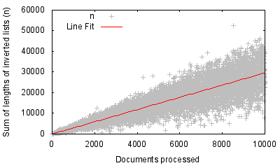

# Introduction

The purpose of this report is to analyse performance of algorithms used to compute similarities between documents and discuss changes that were implemented to improve performance.

# Algorithm `brute.py`

This algorithm computes similarities between documents naively in $O(n^2)$ time, where $n$ is the total number of documents. It computes the similarity of a document with every other document we have already seen. It uses cosine similarity function with tf.idf weights to do this. The results of this function are cached so they do not need to be re-computed. It takes XXX seconds to execute on the first 10,000 news stories.

# Algorithm `index.py`

This algorithm uses an inverted index to compute similarities between documents. It does so with a $O(X)$ run time. It computes the similarity of every document with every other document using an inverted index and tf.idfs weights. Similarly as with `brute.py` the results of tf.idf are cached.

This algorithm uses term-at-a-time execution which has $O(n + N)$ run time where $n$ is the sum of lengths of inverted lists for query terms and $N$ is the total number of documents already processed.

# Algorithm `best.py`

This algorithm is built on top of `index.py`.

Firstly, I replaced the initialisation of the hash for every document in the collection with only initialising an entry for a document if the count is above 0. This improved the runtime only marginally by XXX seconds.

Secondly, I looked at whether using Doc-at-a-time execution could improve the accuracy as the number of documents in the index gets larger. I fitted a linear regression model to $n$, the sum of lengths of inverted lists for query terms. The plot can be observed in figure 1.

\newpage

As can be seen, $n$ starts varying significantly as it gets higher but on average it is linear with respect to the number of documents processed. If this correlation stays true as we process more documents that would imply that Doc-at-a-time's runtime of $O(n \log(n))$ can not beat Term-at-a-time runtime of $O(n + N)$ where $N$ is at most 100,000.

Thirdly, it seems unnecessary to process all occurrences of the word when we only take the document with maximum similarity. Thus we could reduce the length of those lists and sort the entries by weight.

# Conclusion

