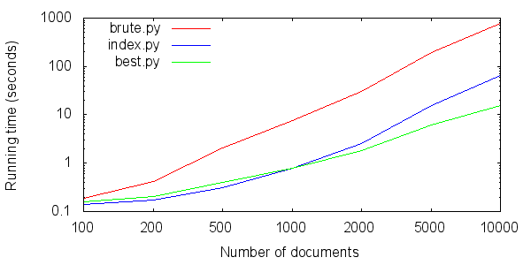

# Introduction

The purpose of this report is to analyse performance of algorithms used to compute similarities between documents and discuss changes that were implemented to improve performance.

# Algorithm `brute.py`

This algorithm computes similarities between documents naively. It computes cosine similarity with tf.idf weights of a document with every other document we have already seen. The results of tf.idf are cached so they do not need to be re-computed. It takes 13 minutes and 13 seconds to execute on the first 10,000 stories.

# Algorithm `index.py`

This algorithm uses an inverted index to compute similarities between documents. Same as `brute.py`, it computes (cached) cosine similarity with tf.idf weights of a document with every other document. However, `index.py` uses an inverted index instead of storing all encountered documents. This results in significantly improved performance and it only takes 1 minute and 5 seconds to process the first 10,000 stories.

This algorithm uses term-at-a-time execution which has $O(n + N)$ run time where $n$ is the total length of all inverted lists for query terms and $N$ is the total number of documents processed.

# Algorithm `best.py`

This algorithm is based heavily on `index.py`. I looked at whether using Doc-at-a-time execution could improve the accuracy as the number of documents in the index gets larger. I fitted a linear regression model to $n$ for the first 10,000 stories. The plot can be observed in figure 1.

As can be seen, $n$ starts varying significantly as it gets higher but on average it is linear with respect to the number of documents processed. If this correlation stays true as we process more documents then Doc-at-a-time's runtime of $O(n \log(n))$ can not beat Term-at-a-time runtime of $O(n + N)$ for $N \leq$ 100,000. Thus I decided not to implement doc-at-a-time execution.

Furthermore, it is unnecessary to process all the documents which have occurrences of the word when we only take one document with maximum similarity. Thus we could sort the entries of an inverted list by weight and reduce the length of the inverted list to some $k$. This is what I ended up implementing using my own priority queue-like object in `best.py`. I experimented with different values of $k$ and settled on $k$ equal to 200. This gave the ideal ratio of speed and accuracy. Table 1 displays accuracy and running time for different values of $k$.

Lastly, figure 2 contains the running time of each algorithm plotted against the number of documents.

: Accuracy compared to `index.py` on first 10,000 documents and Running time of best.py in seconds for different values of $k$.

+-------+----------+--------------+
|  $k$  | Accuracy | Running time |
+=======+==========+==============+
| 100   | 82.51%   | 9.690s       |
+-------+----------+--------------+
| 200   | 90.03%   | 15.250s      |
+-------+----------+--------------+
| 500   | 95.84%   | 25.043s      |
+-------+----------+--------------+
| 1,000 | 98.21%   | 36.528s      |
+-------+----------+--------------+
| 5,000 | 100%     | 70.971s      |
+-------+----------+--------------+

